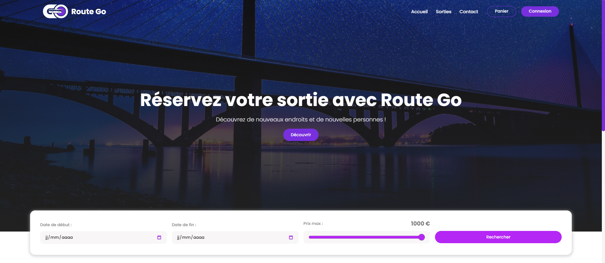
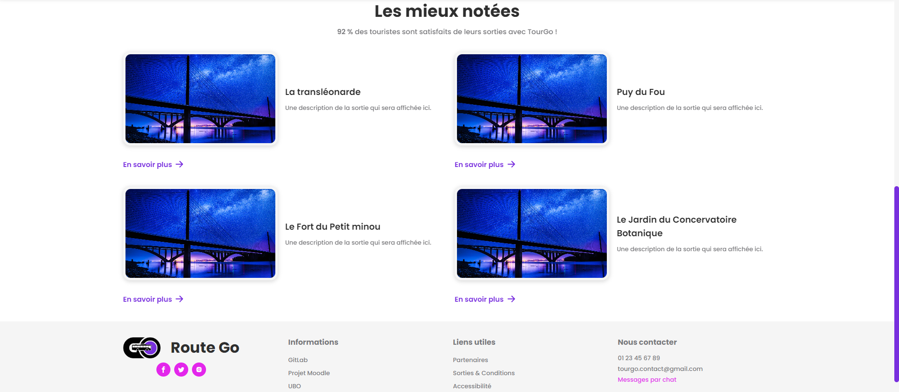
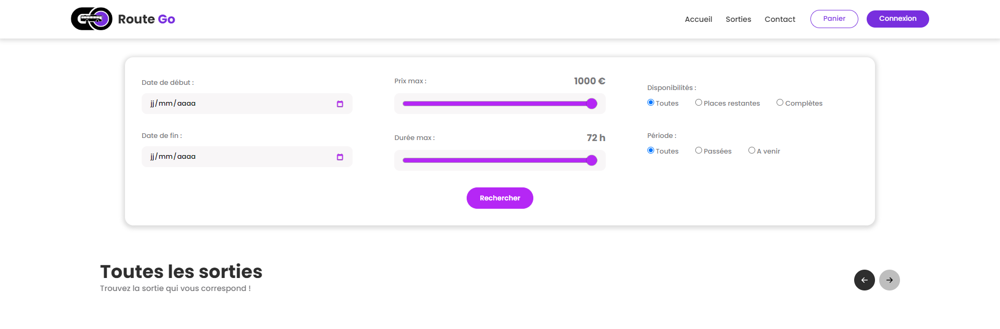
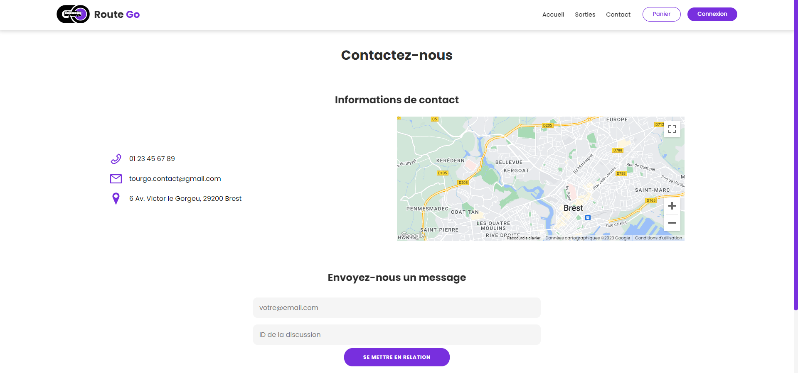
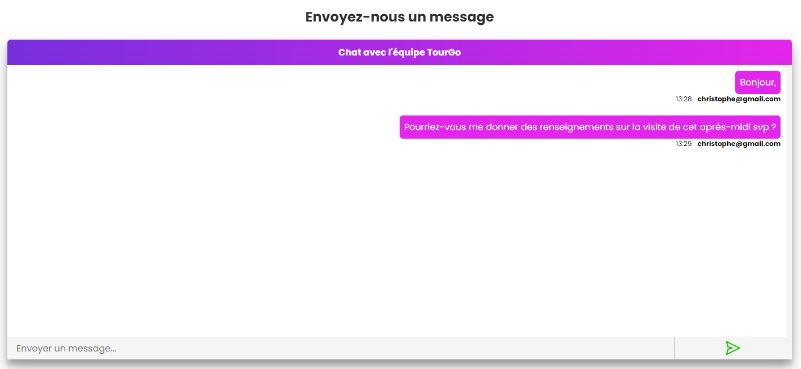
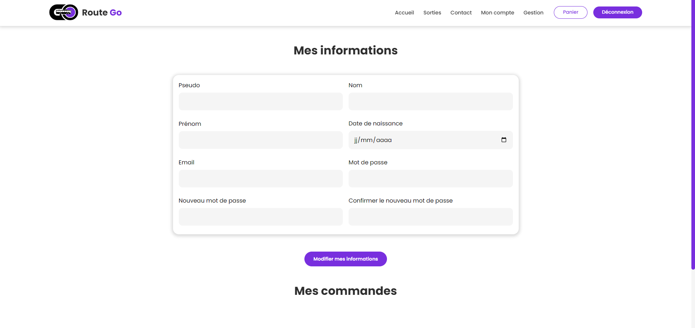
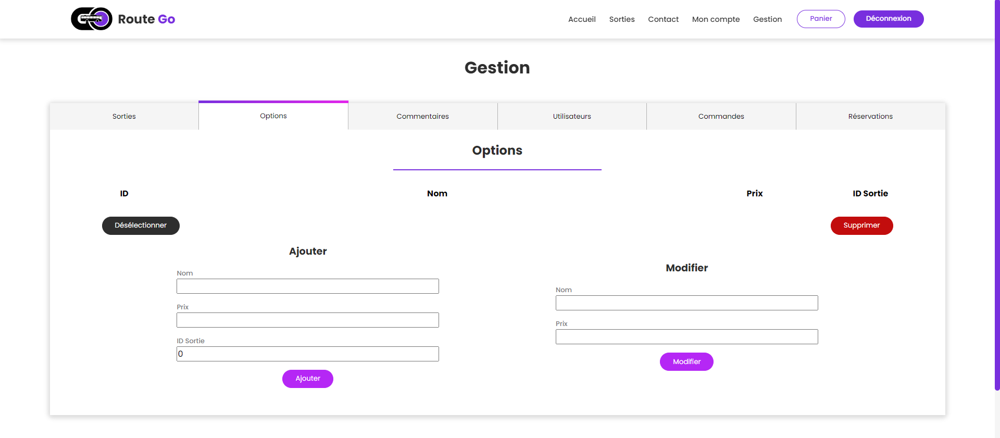
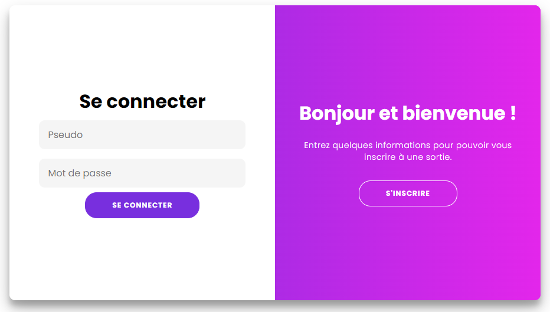
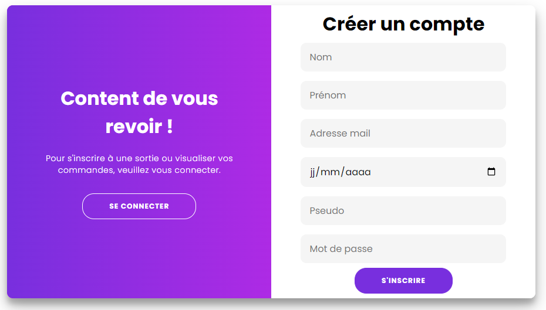

# Tour Go

**Le sujet**

Un Office de Tourisme propose des sorties. Pour chaque sortie, il peut y avoir des options. Par exemple, on peut avoir une sortie d'une journée en bateau dans la Rade de Brest et une option pour le repas de midi, soit un restaurant, soit un pique-nique, ce qui laisse du temps pour une visite supplémentaire.

Le but du projet est de construire une application n-tiers qui utilise des éléments étudiés dans le cadre des UE SOR et SI ; application React, serveur NodeJS et serveur Tomcat/JPA/Spring.

**Fonctionnalités à mettre en oeuvre**

Partie publique :
- Consultation des sorties proposées et de leurs options
- Réservation d'une ou de plusieurs sorties (gestion d'un panier)
- Création de comptes, identification des clients
- Historique des commandes
- Ajout de commentaires sur une sortie effectuée (textes et/ou photos)

Partie privée (administration) : 
- Ajout/Modification d'une sortie et de ses options
- Gestion des comptes
- Statistiques

Option : 
- Chat pour échanger avec l'Office de Tourisme (utiliser les Websockets)

**Technologies à utiliser**

- Client (front)  : React (ou Vue)
- Serveur (back) : Node JS pour la partie publique et Tomcat/- Spring pour la partie privée (ou bien l'inverse). Un serveur peut également déléguer le traitement des requêtes HTTP à un autre serveur.
- Base de données : Mongo DB et MySql

## Équipe

- **Sorin** Alexia : Développeuse (étudiante)
- **Garcia** Christophe : Développeur (étudiant)
- **Cariou** Éric : Chef de projet (professeur)
- **Autret** Yvon : Chef de projet (professeur)

## Liste des fonctionnalités

- Se connecter : différents utilisateurs (visiteurs, utilisateurs connectés, administrateur)
- Voir toutes les sorties avec leurs options, click = vue détaillée sur la sortie
- Réserver une sortie si la sortie n’est pas passée et si places restantes (si connecté)
- Mettre un commentaire (texte, images, note, si connecté)
- Voir et modifier les informations de son compte (si connecté) + voir historique commandes passées (avec réservations, sortie et options associées)
- Administrer les bases de données : CRUD avec liens récursifs (si administrateur)
-  Exemple lien récursif : suppression d’un utilisateur = suppression utilisateur + ses commandes + les réservations associées + les options choisies + ses commentaires 
- Gérer son panier (réservations en cours)
- Statistiques : visibilité des sorties les plus vues et des mieux notées
- Module Google Maps
- Chat : un utilisateur peut communiquer avec l’Office de tourisme p

## Technologies utilisées

- **React JS** : partie front du projet
- **Spring** : serveur back, en lien avec les 2 bases de données
- **NodeJs** : serveur faisant le lien entre ReactJs et Spring
- **MySQL** : base de données principale
- **MongoDB** : base de données pour les commentaires
- **Websockets** : chat entre utilisateurs à l’aide de NodeJS
- **JWT** : gère les échanges sécurisés avec des jetons (droits d’accès)
- **sha256/hmacSHA512/Base64** : cryptage + salage des mots de passe
- **Axios** : envois de requêtes HTTP via React vers Node et Node vers Spring
- **Git** : projet Gitlab (https://gitlab.com/G.Christophe/tourgo/)
- **Postman** : création d’une collection permettant de tester une multitude de requêtes vers Spring

## Quelques screens

L'application n'était pas reliée à la base de données au moment des captures d'écrans. Il manque donc plusieurs pages (Chat, Page d'une sortie, Panier...) et quelques blocs (ex: sorties populaires à la page d'accueil).

### Acceuil

### Sorties

### Contact

### Mon compte

### Gestion

### Connexion/Inscription

